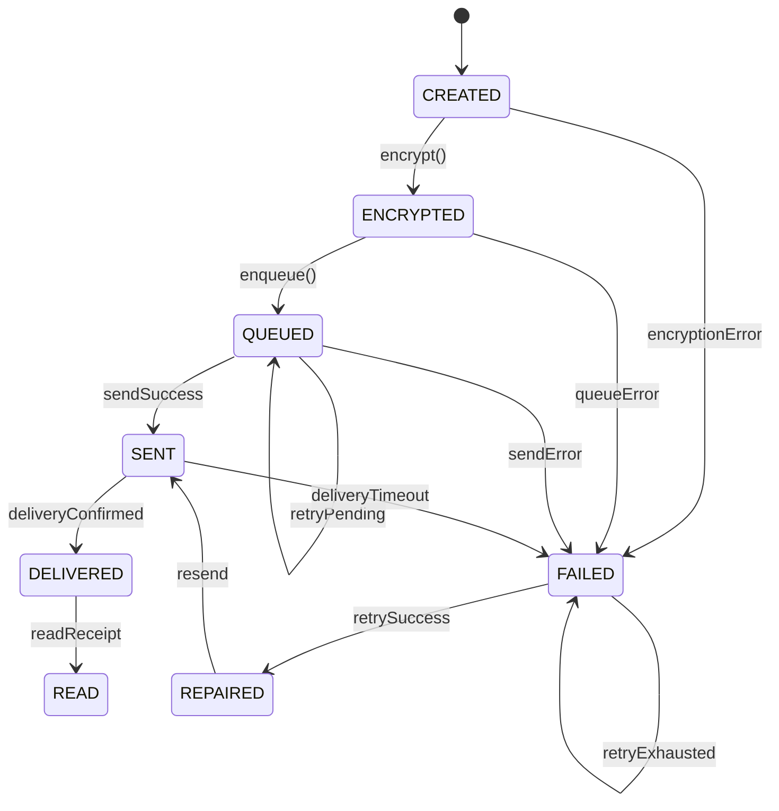

# Message State Machine Specification

> **Version**: 1.0 | **Date**: 2026-02-08 | **Epic**: 11

---

## Overview

This specification defines the deterministic message lifecycle engine for ChatFlect. Every message transitions through a well-defined set of states with strict guards preventing invalid transitions.

---

## Message States

| State | Code | Description |
|-------|------|-------------|
| **CREATED** | 0 | Message object created locally |
| **ENCRYPTED** | 1 | Message successfully encrypted with Signal Protocol |
| **QUEUED** | 2 | Message added to send queue |
| **SENT** | 3 | Message sent to backend (API acknowledged) |
| **DELIVERED** | 4 | Message delivered to recipient's Firestore |
| **READ** | 5 | Recipient marked as read |
| **FAILED** | 6 | Send failed (network, auth, etc.) |
| **REPAIRED** | 7 | Failed message successfully retried |

---

## State Transition Diagram



---

## Allowed Transitions Table

| From State | To State | Trigger | Condition |
|------------|----------|---------|-----------|
| CREATED | ENCRYPTED | `encrypt()` | Encryption success |
| CREATED | FAILED | Error | Encryption failed |
| ENCRYPTED | QUEUED | `enqueue()` | Added to queue |
| ENCRYPTED | FAILED | Error | Queue failed |
| QUEUED | SENT | API 200 | Backend accepted |
| QUEUED | FAILED | API error | Send failed |
| QUEUED | QUEUED | Retry | retry_count < max |
| SENT | DELIVERED | Firestore | Recipient received |
| SENT | FAILED | Timeout | No delivery confirmation |
| DELIVERED | READ | Receipt | Read receipt received |
| FAILED | REPAIRED | Retry OK | Manual or auto retry |
| REPAIRED | SENT | Resend | New send attempt |

---

## Invalid Transitions (Blocked)

The following transitions are **STRICTLY BLOCKED**:

| From | To | Reason |
|------|----|--------|
| CREATED | SENT | Must encrypt first |
| CREATED | DELIVERED | Must go through full pipeline |
| ENCRYPTED | DELIVERED | Must be sent first |
| QUEUED | DELIVERED | Must confirm send |
| SENT | CREATED | Cannot revert to initial |
| READ | any | Terminal state |
| FAILED | CREATED | Cannot revert |

---

## State Transition Guard

```typescript
const TRANSITIONS: Record<MessageState, MessageState[]> = {
  [MessageState.CREATED]: [MessageState.ENCRYPTED, MessageState.FAILED],
  [MessageState.ENCRYPTED]: [MessageState.QUEUED, MessageState.FAILED],
  [MessageState.QUEUED]: [MessageState.SENT, MessageState.FAILED, MessageState.QUEUED],
  [MessageState.SENT]: [MessageState.DELIVERED, MessageState.FAILED],
  [MessageState.DELIVERED]: [MessageState.READ],
  [MessageState.READ]: [], // Terminal
  [MessageState.FAILED]: [MessageState.REPAIRED, MessageState.FAILED],
  [MessageState.REPAIRED]: [MessageState.SENT],
};

function canTransition(from: MessageState, to: MessageState): boolean {
  return TRANSITIONS[from]?.includes(to) ?? false;
}
```

---

## State Persistence Schema

| Column | Type | Description |
|--------|------|-------------|
| `state` | INTEGER | Current state code (0-7) |
| `state_version` | INTEGER | Monotonic version counter |
| `last_transition_at` | TIMESTAMP | Last state change time |
| `last_error` | TEXT | Error message if FAILED |
| `retry_count` | INTEGER | Number of retry attempts |

---

## Logging

All state transitions are logged with:

```json
{
  "event": "MESSAGE_STATE_TRANSITION",
  "messageId": "msg_uuid",
  "fromState": "QUEUED",
  "toState": "SENT",
  "stateVersion": 3,
  "timestamp": "2026-02-08T01:25:00Z"
}
```

**Invalid transitions** are logged as errors:

```json
{
  "event": "INVALID_STATE_TRANSITION",
  "messageId": "msg_uuid",
  "fromState": "CREATED",
  "toState": "DELIVERED",
  "error": "Direct transition from CREATED to DELIVERED not allowed",
  "timestamp": "2026-02-08T01:25:00Z"
}
```

---

## Crash Recovery

On app restart:
1. Query all messages with `state IN (ENCRYPTED, QUEUED)`
2. Add to pending transition replay queue
3. Resume processing from last known state

---

## Test Cases

| TC | Description | Expected |
|----|-------------|----------|
| TC-SM-01 | CREATED → ENCRYPTED | ✅ Allowed |
| TC-SM-02 | CREATED → SENT | ❌ Blocked |
| TC-SM-03 | QUEUED → SENT | ✅ Allowed |
| TC-SM-04 | SENT → CREATED | ❌ Blocked |
| TC-SM-05 | FAILED → REPAIRED | ✅ Allowed |
| TC-SM-06 | READ → CREATED | ❌ Blocked |
