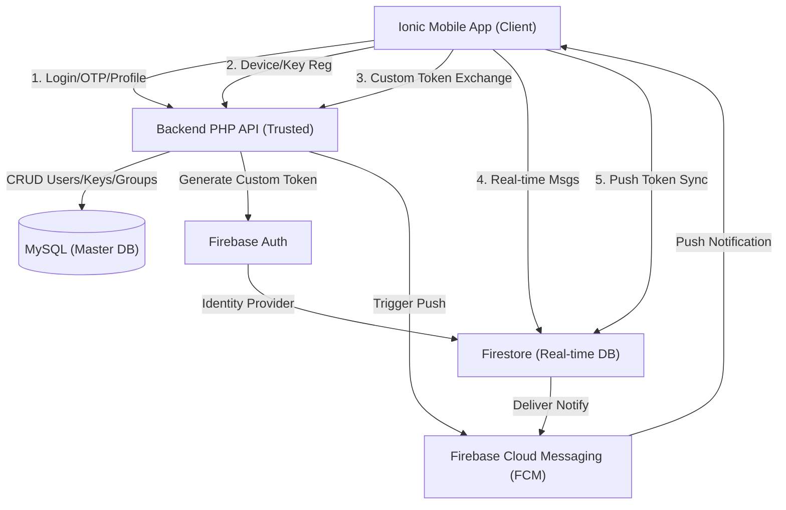
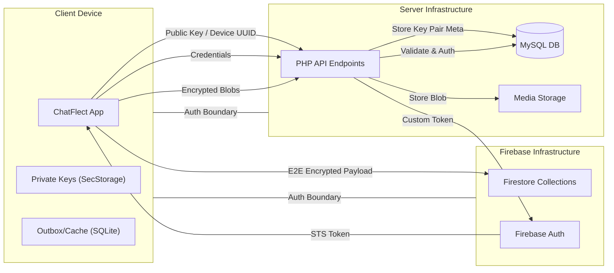
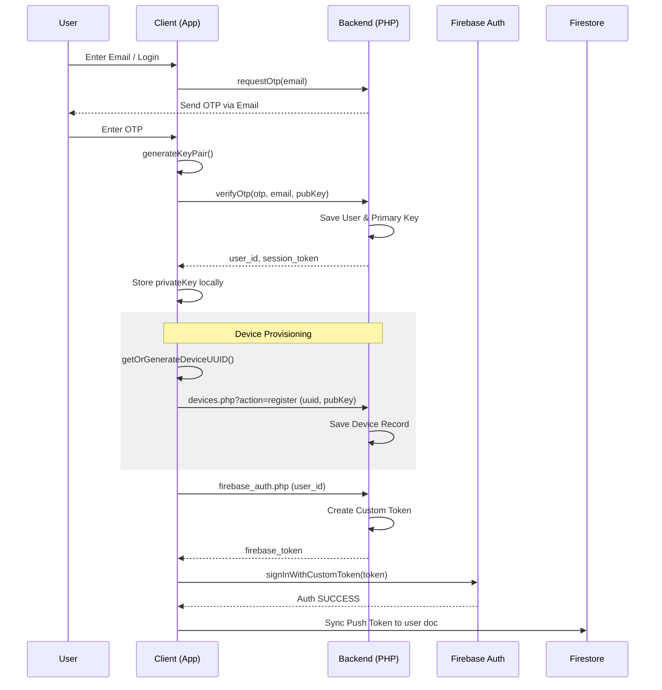
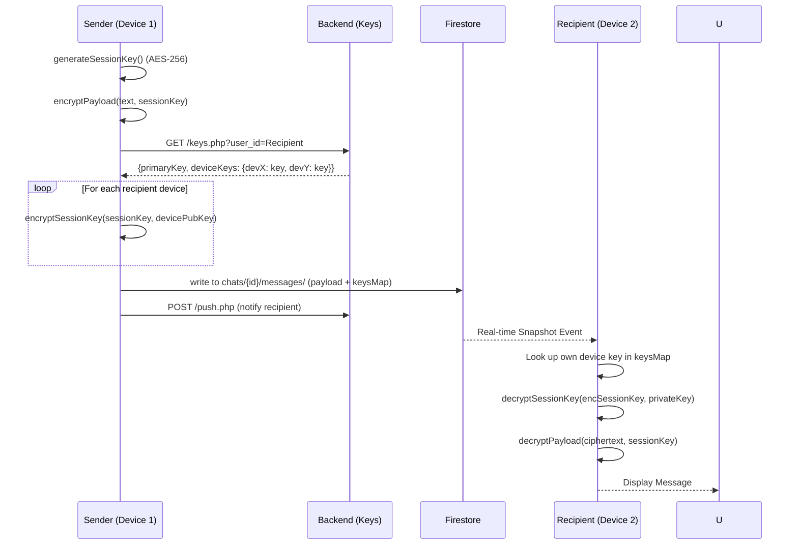

# System Architecture & Data Flows - ChatFlect

This document provides a visual and technical map of the ChatFlect system architecture, data flows, and trust boundaries.

## 1. High-Level Architecture

The system follows a hybrid architecture combining a traditional PHP/MySQL backend for master records and discovery, with Firebase for real-time messaging and notifications.

---

## 2. Data Flow Diagram (DFD) & Trust Boundaries

Trust boundaries are defined between the untrusted mobile device and the trusted server-side infrastructure.

---

## 3. Sequence Diagrams

### 3.1 Authentication & Device Provisioning

Detailed flow of landing on a device, registering keys, and establishing a Firebase session.

---

### 3.2 E2EE Message Delivery Flow

How a message is encrypted and distributed to multiple recipients and their devices.

---

## 4. Security Assumptions List

Based on the mapping, the system operates under the following assumptions:

1.  **Client-Side Integrity**: The application code on the device is unmodified (enforced via App Attestation or Play Integrity, if implemented).
2.  **Key Isolation**: The `private_key` never leaves the `SecureStorage` or `LocalStorage` of the device.
3.  **Transport Security**: All Client-Backend and Client-Firebase communication occurs over TLS (HTTPS/WSS).
4.  **Backend Trust**: The PHP API is trusted to manage the mapping of User IDs to Public Keys accurately (a "Key Transparency" audit is required to verify this assumption).
5.  **Firestore Isolation**: Firebase Security Rules are correctly configured to prevent unauthorized reads/writes to `chats` collections (Trust Boundary).
