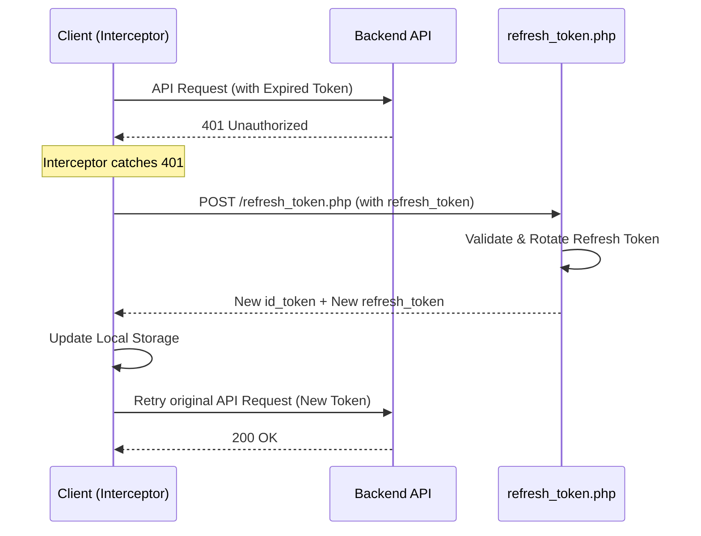

# Authentication Flow & Lifecycle - ChatFlect

This document maps the complete authentication lifecycle of ChatFlect, spanning the PHP Backend, Mobile Client, and Firebase services.

## 1. Authentication Overview
ChatFlect uses a hybrid authentication model. Identity is established via the **PHP Backend** (OTP or Google OAuth), which then issues a custom token to bridge into the **Firebase Infrastructure**.

---

## 2. Authentication Lifecycle

### 2.1 Initial Sign-In (Provisioning)
1.  **OTP Request**: Client calls `register.php` with an email. Backend sends OTP and stores it in the database.
2.  **Verification**: Client calls `profile.php?action=confirm_otp` with the OTP and its locally generated **Public Key**.
3.  **Session Establishment**:
    - Backend validates OTP.
    - Backend stores the Public Key for the user.
    - Backend generates a **JWT ID Token** and a **Refresh Token**.
    - Backend returns these tokens plus the `user_id`.
4.  **Local Storage**: Client saves `user_id`, `id_token`, `refresh_token`, and the private key of the pair.

### 2.2 Firebase Bridge (Custom Token Exchange)
To access Firestore and FCM, the client must authenticate with Firebase:
1.  Client calls `firebase_auth.php`.
2.  Backend `auth_middleware.php` validates the PHP `id_token`.
3.  `firebase_auth.php` uses the **Firebase Admin SDK** (via `SimpleJWT`) to generate a **Custom Token** for the user's UID.
4.  Client receives the Custom Token and calls `signInWithCustomToken()`.
5.  Firebase verifies the token and issues a standard Firebase ID Token.

### 2.3 Token Usage & Interceptors
- **Client Side**: Every outgoing API request is intercepted by `AuthInterceptor`. It attaches the `Authorization: Bearer <id_token>` and `X-User-ID` headers.
- **Backend Side**: `auth_middleware.php` intercepts requests:
    1.  Extracts the token from headers.
    2.  Check Cache: Uses `CacheService` for fast validation of active sessions.
    3.  Slow Path: Validates JWT signature and expiration.
    4.  Identity Resolution: Maps Google `sub` to a local `user_id` if necessary.

---

## 3. Token Refresh Lifecycle

Token rotation is handled automatically to maintain session persistence without frequent user interaction.

---

## 4. Failure Scenarios

| Scenario | Behavior | Resolution |
| :--- | :--- | :--- |
| **Expired Token** | Backend returns `401`. | `AuthInterceptor` triggers silent refresh. |
| **Invalid Token** | Backend returns `401`. | If refresh fails, `AuthService.logout()` is called. |
| **Account Blocked** | Backend returns `403`. | `AuthInterceptor` triggers immediate logout and user alert. |
| **Offline Refresh Failure** | Persistent `401` or network error. | App enters offline mode; outbox caches actions. |
| **Custom Token Failure** | `firebase_auth.php` fails. | Chat service waits via `FIREBASE_READY_TIMEOUT_MS`. |

---

## 5. Security Gates (Entry Points)

| Entry Point | Protocol | Requirement |
| :--- | :--- | :--- |
| **Backend API** | REST / HTTPS | Valid PHP JWT in `Authorization` header. |
| **Firestore** | WSS / SDK | Valid Firebase Auth Session (via Custom Token). |
| **Media Blobs** | HTTPS | Valid Session via `serve.php` gate. |

---

## 6. Security Considerations & Risks (Phase 1 Baseline)

| Risk ID | Title | Security Impact | Status |
| :--- | :--- | :--- | :--- |
| **R1** | Refresh Token Rotation | Token reuse could lead to session hijacking. | Rotation exists; reuse detection pending verification. |
| **R2** | Key Injection at OTP | Compromised OTP allows attacker to register their public key. | Baseline risk; requires device approval flow in Phase 2. |
| **R3** | Custom Token Scope | Custom tokens must be strictly bound to session + UID. | Bound to UID; device-binding recommended. |

---
> [!IMPORTANT]
> **Trust Boundary**: The PHP Backend is the ultimate source of truth for identity. Firebase services trust the Backend via the Service Account Private Key used to sign custom tokens.
