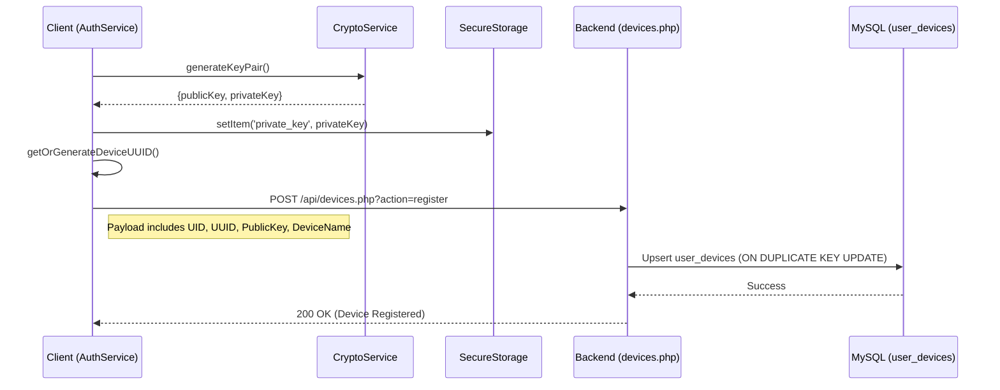

# Device Provisioning Flow - ChatFlect

This document maps the technical flow for identifying devices, generating cryptographic keys, and registering them with the ChatFlect backend.

## 1. Device Identification
Each device (mobile or desktop) must have a unique identifier for E2EE key mapping and push notification targeting.

- **Generation**: Device UUIDs are generated on the client if not present in `localStorage`.
- **Format**: `dev_{timestamp}_{random_string}` (e.g., `dev_1707180000000_a1b2c3d4e`).
- **Persistence**: 
    - **Device ID (`device_uuid`)**: Stored in standard `localStorage`.
    - **Device Name**: Primarily based on Capacitor's device info (e.g., "Android Pixel 7" or "iOS iPhone 14").

---

## 2. Cryptographic Key Provisioning
Device registration and E2EE readiness occur during the initial sign-in/verification phase.

1.  **Key Generation**: Upon successful OTP entry or OAuth login, the `CryptoService` generates a unique **RSA-2048 key pair**.
2.  **Private Key Storage**: The private key is stored immediately in **SecureStorageService**.
    - **Native**: Stored in Keychain (iOS) or Keystore (Android) via the `capacitor-secure-storage-plugin`.
    - **Web Fallback**: Stored in `localStorage` encrypted with a key derived from a device fingerprint (AES-GCM).
3.  **Public Key Export**: The public key is exported as a string for backend registration.

---

## 3. Registration Pipeline

The provisioning process is triggered automatically by `AuthService.setSession()`.

---

## 4. Multi-Device Management & Eviction
ChatFlect supports multiple devices per user with strict security constraints.

- **Storage Layer**: The `user_devices` table stores a unique index on `(user_id, device_uuid)`.
- **Device Limit (R1)**: A hard limit of **5 devices** per user is enforced by `devices.php`.
- **LRU Eviction**: If a 6th device is registered:
    1.  The backend identifies the **oldest active device** (by `last_active` timestamp).
    2.  The oldest device is deleted from `user_devices`.
    3.  All sessions (`user_sessions`) for that specific device are invalidated.
    4.  An audit log entry `DEVICE_EVICTED_MAX_LIMIT` is created.
- **Revocation**: A user can manually revoke a device via the UI, which triggers a `DELETE` request to `devices.php` and immediate session cleanup.

---

## 5. Security Summary

| Logic | Implementation | Security Benefit |
| :--- | :--- | :--- |
| **Private Key Isolation** | No private key ever leaves the device. | Guarantees E2E confidentiality. |
| **Secure Persistence** | OS-level Keystore/Keychain. | Protects against secondary app access or physical data theft. |
| **Atomic Revocation** | Database triggers delete active session tokens. | Ensures a revoked device cannot refresh tokens. |
| **Normalized UID** | UID forced to uppercase on backend. | Prevents duplicate registration due to case sensitivity. |

---

## 6. Security Considerations & Risks (Phase 1 Baseline)

| Risk ID | Title | Security Impact | Status |
| :--- | :--- | :--- | :--- |
| **D1** | `device_uuid` Persistence | Store in `localStorage` allows potential identity impersonation. | Plaintext storage; audit backend binding. |
| **D2** | Web Fallback Keying | Fingerprint entropy might be insufficient for secure path. | Audit fingerprinting robustness. |
| **D3** | Eviction Visibility | Users unaware of device eviction/revocation until failure. | Baseline behavior; notify devices in Phase 2. |
