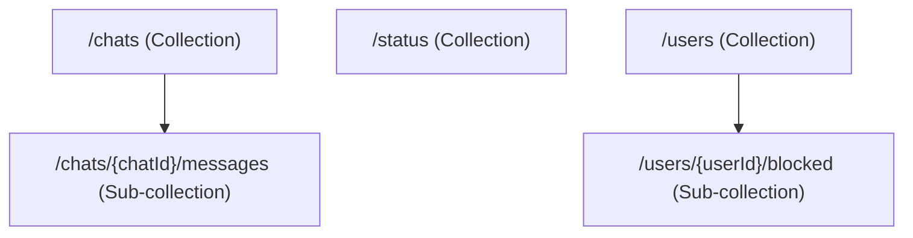

# Firestore Collections Map - ChatFlect

This document outlines the Firestore collection structure, expected document schemas, and data ownership/access patterns.

## 1. Collection Structure Overview

---

## 2. Collection Details

### 2.1 `chats` Collection
Stores metadata for both private and group chats.

| Field | Type | Description |
| :--- | :--- | :--- |
| `participants` | `array<string>` | List of User IDs allowed to access this chat. |
| `isGroup` | `boolean` | True if the chat is a group chat. |
| `groupName` | `string` | Name of the group (if applicable). |
| `lastMessage` | `string` | Snippet of the last message (often generic like "🔒 Message"). |
| `lastTimestamp`| `number` | Timestamp of the last activity. |
| `typing` | `map<string, timestamp>` | Map of User IDs currently typing to their start timestamp. |
| `unread_{uid}` | `number` | Counter for unread messages per user. |

**Ownership/Access:**
- **Read**: Any user in `participants`.
- **Write**: Any user in `participants` (for metadata updates like typing or last timestamp).

---

### 2.2 `chats/{chatId}/messages` Sub-collection
The primary transport for E2EE messages.

| Field | Type | Description |
| :--- | :--- | :--- |
| `id` | `string` | Unique Message ID. |
| `senderId` | `string` | Normalized User ID of the sender. |
| `timestamp` | `number` | Creation timestamp. |
| `type` | `string` | Content type (`text`, `image`, `video`, `document`, etc.). |
| `ciphertext` | `string` | Base64 E2E encrypted message data (if applicable). |
| `iv` | `string` | Initialization Vector for decryption. |
| `keys` | `map<string, map<string, string>>` | Map of `recipientId -> {deviceId -> encSessionKey}`. |
| `expiresAt` | `number` | (Optional) TTL for disappearing messages. |
| `isDeleted` | `boolean` | (Optional) Flag for revoked messages. |

**Ownership/Access:**
- **Read**: Any user in the parent chat's `participants`.
- **Write**: Only the user identified in `senderId`.

---

### 2.3 `status` Collection
Public-facing presence information.

| Field | Type | Description |
| :--- | :--- | :--- |
| `state` | `string` | `online` or `offline`. |
| `last_changed` | `timestamp` | Server-side timestamp of the last state change. |
| `platform` | `string` | E.g., `mobile` or `web`. |
| `heartbeat` | `timestamp` | Periodic heartbeat to detect zombie sessions. |

**Ownership/Access:**
- **Read**: Authenticated users (usually contacts, but currently global).
- **Write**: Only the owner of the document (`request.auth.uid == userId`).

---

### 2.4 `users/{userId}/blocked` Sub-collection
Individual user preferences for blocking.

| Field | Type | Description |
| :--- | :--- | :--- |
| `{blockedUserId}` | `document` | Document ID is the ID of the blocked user. |
| `blocked_at` | `string` | ISO timestamp of the block action. |

**Ownership/Access:**
- **Read**: Only the owner of the parent user document.
- **Write**: Only the owner of the parent user document.

---

## 3. Security Hardening Notes (Phase 2 Focus)

- **Unprotected Snippets**: `lastMessage` in the `chats` collection may leak information if not restricted (currently uses generic strings for private chats).
- **Key Map Exposure**: Even though keys are encrypted, the *existence* and *count* of devices for a recipient are visible in the message payload.
- **Presence Leaking**: Currently, any authenticated user can read the `status` of any other user ID. Boundary should be limited to contacts.
- **Message Integrity**: The `isDeleted` and `expiresAt` fields are currently controlled by the sender; recipients have no way to cryptographically verify these "control" signals without a signed header.
