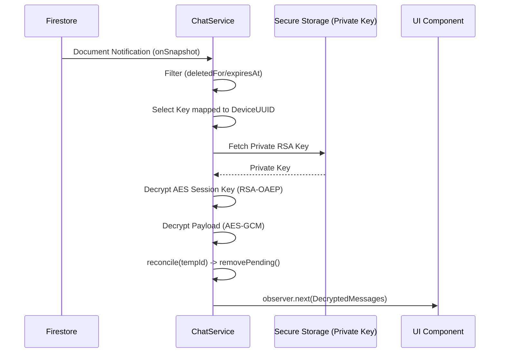

# Message Receive Pipeline Flow - ChatFlect

This document maps how the ChatFlect client discovers, decrypts, and displays incoming encrypted messages from Firestore.

## 1. Phase A: Discovery & Listener Lifecycle
The client maintains real-time connectivity to Firestore to ensure instant message delivery.

1.  **Subscription**: `ChatService.getMessages` creates an `onSnapshot` listener on the `/chats/{chatId}/messages` collection.
2.  **Stream Management**: The listener is wrapped in an RxJS Observable with `shareReplay({ bufferSize: 1, refCount: true })`. This ensures:
    - Multiple UI components can share the same data stream.
    - The listener is automatically torn down when the last UI component unsubscribes.
3.  **Metadata Filtering**: The client immediately filters out documents based on:
    - `deletedFor`: Checks if the current user has "hidden" this message.
    - `expiresAt`: Checks if the message has exceeded its TTL (Time-To-Live).

## 2. Phase B: The Decryption Pipeline
Once a new document is received, it enters the decryption sequence.

### Step 1: Session Key Recovery (RSA)
The client must recover the AES session key intended for its specific device.
- **Key Selection**: The client looks up `keys[myUid][myDeviceUuid]`. 
- **Legacy Fallback**: If the device-specific key is missing, it falls back to `keys[myUid]['primary']`.
- **RSA Decrypt**: The recovered ciphered key is decrypted using the device's **Private RSA Key** (stored in `SecureStorageService`).

### Step 2: Content Recovery (AES-GCM)
With the Session Key (AES) recovered:
- **AES Decrypt**: The `ciphertext` is decrypted using **AES-256-GCM** with the message-specific `iv`.
- **Integrity Check**: AES-GCM provides built-in authentication; if the tag is invalid, decryption fails immediately.

## 3. Phase C: UI Reconciliation & Display
The final step is to merge the server's truth with the client's local state.

1.  **Optimistic Cleanup**: Each incoming message is checked for a `tempId`. If a match is found in the local `pendingMessages` list, the placeholder is removed via `removePending`.
2.  **State Mapping**: The message is converted into a UI model with a `state` flag:
    - `OK`: Successfully decrypted and ready for display.
    - `DECRYPTING`: Transient state during processing.
    - `KEY_MISSING`: The message was not encrypted for this device (e.g., device was registered *after* message was sent).
    - `DECRYPT_FAILED`: Potential corruption or invalid private key.
3.  **Notification**: If the message is new (`timestamp > lastKnownTimestamp`) and not sent by the current user, a notification signal is emitted.

---

## 4. Sequence Diagram Overview

---

## 5. Security Summary & Assumptions

| Feature | Implementation | Security Benefit |
| :--- | :--- | :--- |
| **In-Memory Decryption** | Plaintext is never written to persistent disk (except optional cache). | Protects against static data theft. |
| **Device Isolation** | One device cannot decrypt keys intended for another device. | Limits the impact of a single device compromise. |
| **Integrity Enforcement** | GCM authentication tags verified on every message. | Prevents "Bit-flipping" or ciphertext tampering. |

---

## 6. Security Considerations & Risks (Phase 1 Baseline)

| Risk ID | Title | Security Impact | Status |
| :--- | :--- | :--- | :--- |
| **G1** | **Local Message Cache** | Decrypted messages are cached in `StorageService` (SQLite). | Optional; ensures performance but adds local risk. |
| **G2** | **"Invisible" Failures** | `KEY_MISSING` state might confuse users if not handled in UI. | Baseline UI shows "Key missing for this device". |
| **G3** | **Key Swap Recovery** | If a user wipes their device without backup, old messages are lost. | Fundamental to E2E; no server-side recovery exists. |

> [!IMPORTANT]
> **Risk G3** is the intended behavior of E2EE. Users must be educated that clearing "Secure Storage" without a key backup result in permanent loss of message history.
