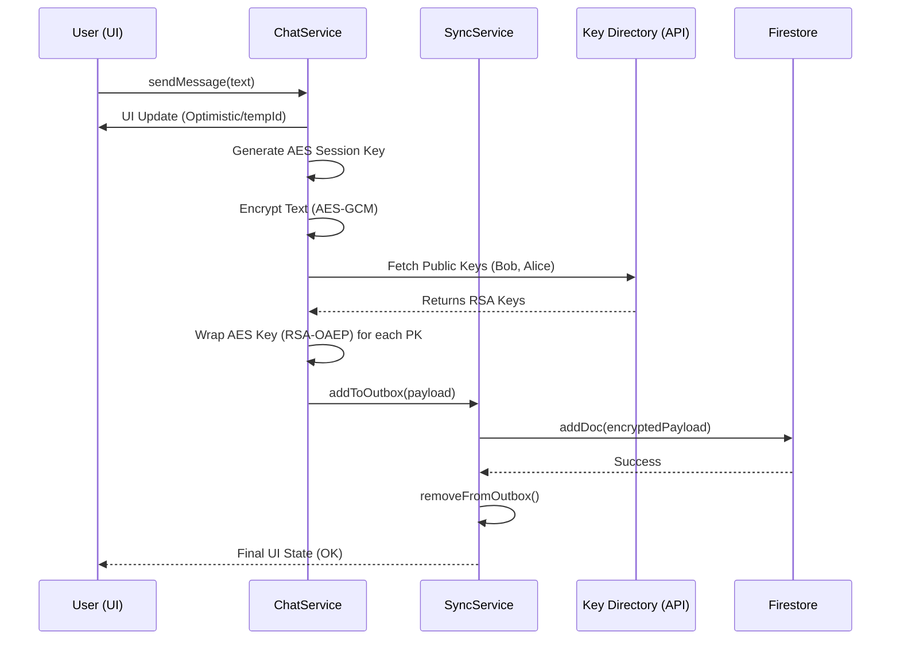

# Message Send Pipeline Flow - ChatFlect

This document maps the journey of a message from the client's interface to its encrypted resting state in Firestore. It covers the encryption sequence, offline persistence, and delivery guarantees.

## 1. Phase A: User Submission & Optimistic UI
The process begins immediately upon the user clicking "Send" to provide a seamless experience.

1.  **ID Generation**: A `tempId` is generated using `tmp_{timestamp}_{random}`.
2.  **Optimistic UI**: The message is added to the local `messagesSubject` with a state of `isOffline: true`. This allows the user to see their message instantly without waiting for network or encryption overhead.

## 2. Phase B: The E2EE Encryption Pipeline
Before reaching the network, the message undergoes a multi-standard encryption process.

1.  **Session Key Generation**: A random **AES-256-GCM** key is generated for the specific message.
2.  **Payload Encryption**: The plaintext is encrypted with the AES key and a fresh 12-byte IV.
3.  **Key Discovery**: The `ChatService` performs a parallel fetch for all recipient public keys (Bob's Phone, Bob's Tablet, Alice's PC, etc.).
4.  **RSA Wrap (Fan-out)**: The AES Session Key is encrypted (RSA-OAEP) for *each* recipient device.
5.  **Payload Construction**: A unified JSON payload is created containing the `ciphertext`, `iv`, and the `keys` map.

## 3. Phase C: Persistence & Outbox (Offline Guard)
To ensure reliability on unstable networks, ChatFlect uses a "Store-and-Forward" approach.

- **SQLite Outbox**: The encrypted payload is saved to a local SQLite database (`storage.addToOutbox`).
- **Sync Guard**: The `SyncService` monitors network status. If offline, the message remains in the outbox.
- **Reconciliation**: The `tempId` is bundled with the payload to allow the real-time listener to replace the "Optimistic" message with the "Server" message once delivered.

## 4. Phase D: Firestore Delivery & Delivery Acks
1.  **Firestore Write**: `addMessageDoc` writes the payload to `/chats/{chatId}/messages`.
2.  **Parent Update**: The `chats` document is updated with the last message snippet (e.g., "🔒 Message") and incremented unread counts.
3.  **Sync Completion**: Upon success, the message is removed from the SQLite Outbox.
4.  **Delivery Status**: Recipients' devices acknowledge receipt by updating their `read_until` timestamps or specific message flags in secondary logic.

---

## 5. Sequence Diagram Overview

---

## 6. Technical Specifications

| Field | Description | Security |
| :--- | :--- | :--- |
| `ciphertext` | AES-256-GCM encrypted message body. | Plaintext never touches the cloud. |
| `iv` | Initialization Vector (Base64). | Must be unique per message. |
| `keys` | Map of `UID -> { DeviceUUID: EncryptedKey }`. | Isolated per device. |
| `tempId` | Client-generated tracking ID. | Used for UI reconciliation only. |

---

---

## 7. Security Considerations & Risks (Phase 1 Baseline)

| Risk ID | Title | Security Impact | Status |
| :--- | :--- | :--- | :--- |
| **F1** | **Key Fan-out Latency** | **Large groups cause sending delay on low-end hardware.** | **Baseline tradeoff; monitor in Phase 2.** |
| **F2** | **Metadata Exposure** | SenderId, Timestamp, and KeyMap are visible to server. | E2EE covers payload only, not metadata. |
| **F3** | **Order Integrity** | Lack of cryptographic chaining in Phase 1 (No Double Ratchet). | Baseline risk; use simple SeqIDs for now. |

---

> [!NOTE]
> **Risk F1** is a known performance/security tradeoff. As the number of participants grows, the client-side CPU overhead for RSA-OAEP encryption scales linearly for the message session key.
