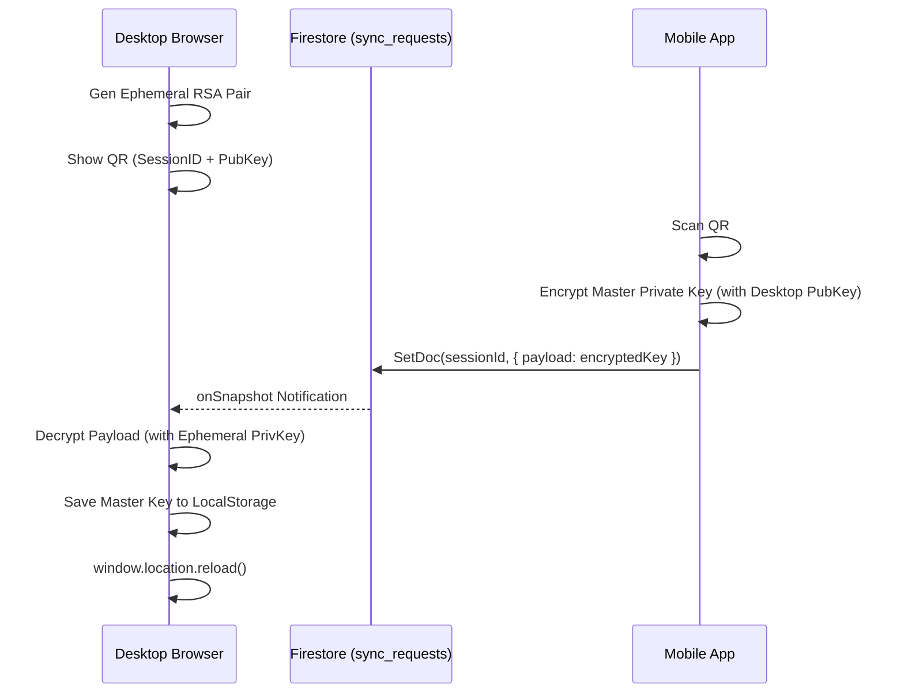

# Multi-Device Sync Flow (TASK 1.1-H) - ChatFlect

This document explains how ChatFlect maintains consistency across multiple devices and how the critical "Master Private Key" is transferred to enable historical message decryption on new logins.

## 1. The "Transfer of Trust" Problem
In an E2EE system, the server never holds the private key. When a user logs in on a second device (e.g., Desktop) via OTP, they get a fresh session but **cannot decrypt old messages** because those messages were never encrypted for the new device's independent RSA key.

To solve this, ChatFlect provides two mechanisms for "Mirroring" the identity.

## 2. Mechanism A: Desktop Link (Session Mirroring)
This is the primary way to sync a mobile session to a desktop client.

1.  **Ephemeral Key Gen**: The Desktop client generates a one-time **RSA-OAEP** pair and displays a QR code containing the `sessionId` and its `Ephemeral Public Key`.
2.  **Handshake**: The Mobile app scans the QR, imports the ephemeral public key, and encrypts the user's **Master Private Key** (and other session data like `user_id`, `token`).
3.  **Encrypted Transport**: The encrypted payload is uploaded to Firestore at `/sync_requests/{sessionId}`.
4.  **Mirroring**: The Desktop listener receives the payload, decrypts it using its ephemeral private key, saves the Master Private Key to local storage, and reloads the app.
5.  **Result**: Both devices now share the same identity and can decrypt the same messages.

## 3. Mechanism B: Manual Backup (Key Migration)
Users can manually migrate their keys between Any-to-Any devices.

- **Export**: `BackupService` creates an unencrypted JSON blob containing the base64 Private Key, Public Key, and user profile metadata.
- **Import**: The user provides this JSON file on a new device. The app restores the keys directly to `localStorage`, bypassing the need for a fresh key generation.

## 4. Historical Catch-up
Once a device has the correct keys (either through mirroring or being registered at the time of sending):

1.  **Snapshot Listener**: `ChatService` subscribes to the last 20-50 messages.
2.  **Decryption Loop**: For each message, the client looks for a key entry in the `keys` map that matches its `device_uuid` or the generic `primary` key.
3.  **Gap Identification**: If no key exists for the device and the master key isn't mirrored, the message remains in the `KEY_MISSING` state.

---

## 5. Sequence Diagram: Desktop Linking

---

## 6. Security Considerations & Risks (Phase 1 Baseline)

| Risk ID | Title | Security Impact | Status |
| :--- | :--- | :--- | :--- |
| **H1** | **Sync Request TTL** | Sync requests in Firestore could linger if cleanup fails. | Cleanup is client-side; ensure server-side TTL. |
| **H2** | **Backup Security** | Backup JSON is currently unencrypted plaintext. | **HIGH RISK**: User must store file securely. |
| **H3** | **Handshake Phishing** | An attacker could trick a user into scanning a rogue QR link. | Requires visual verification of sessionId (v2). |

---

## 7. Edge Cases & Handling

- **Device Revocation**: If Device A is revoked while Device B is syncing, the mirrored token will eventually fail at the `refresh_token.php` layer.
- **Long-term Offline**: A device offline for months will simply "re-stream" the last `N` messages from Firestore once it reconnects. If it missed the "Key Envelope" (because it was evicted from the 5-device limit), it will show `KEY_MISSING`.
- **Key Rotation**: If the user generates a new primary key, all synced copies must eventually receive the update or they will lose access to new messages.
