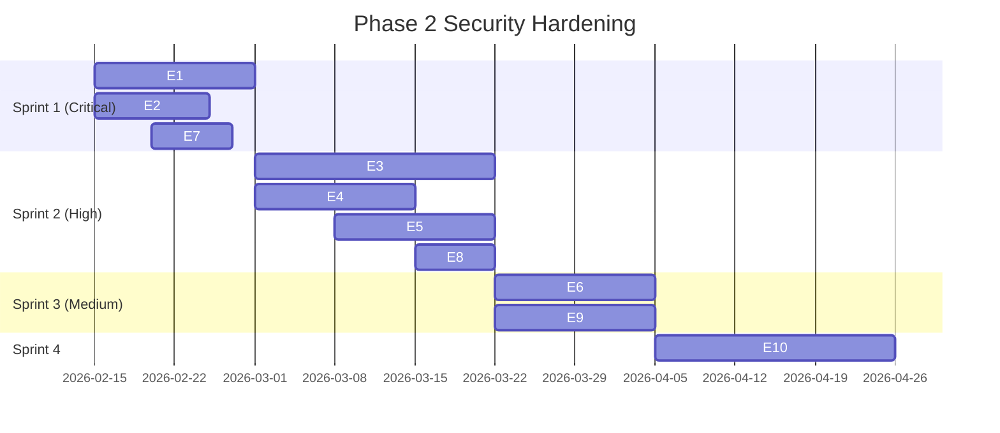

# Phase 2 Mitigation Roadmap (TASK 1.3-G) - ChatFlect Security

> **Version**: 1.0 | **Date**: 2026-02-06 | **Format**: Jira-Ready WBS

---

## 1. Epic Overview

| Epic ID | Epic Name | Priority | Threats Addressed | Sprint Target |
| :---: | :--- | :---: | :--- | :---: |
| **E1** | Backend Authentication Enforcement | CRITICAL | J4, J5, J6, J7, J8, J9 | Sprint 1 |
| **E2** | Encrypted Backup System | CRITICAL | H2 | Sprint 1 |
| **E3** | Signed Key Bundles + Safety Numbers | HIGH | E1, CP-06 | Sprint 2 |
| **E4** | SQLCipher Encryption | HIGH | G1 | Sprint 2 |
| **E5** | Token Storage Migration | HIGH | T1-S-02, T1-E-01 | Sprint 2 |
| **E6** | Metadata Privacy Enhancement | HIGH | I1, I2 | Sprint 3 |
| **E7** | Anti-Abuse Controls | HIGH | OTP abuse, rate limiting | Sprint 1 |
| **E8** | Firestore Rules Lockdown | MEDIUM | T3-E-01 | Sprint 2 |
| **E9** | Audit Logging + Tamper Evidence | MEDIUM | T1-R-01, T1-R-02 | Sprint 3 |
| **E10** | Key Transparency Log | MEDIUM | CP-07 | Sprint 4 |

---

## 2. EPIC E1: Backend Authentication Enforcement

### Summary
Add JWT/session authentication to all unauthenticated PHP endpoints.

### Tasks

| Task ID | Task | Owner | Effort | Acceptance Criteria |
| :---: | :--- | :---: | :---: | :--- |
| E1-T1 | Create JWT middleware for PHP | Backend | M | Middleware extracts and validates JWT |
| E1-T2 | Add auth to `devices.php` | Backend | S | Returns 401 without valid token |
| E1-T3 | Add auth to `keys.php` | Backend | S | Returns 401 without valid token |
| E1-T4 | Add auth to `groups.php` + role check | Backend | M | Only admins can modify membership |
| E1-T5 | Add auth to `upload.php` + quotas | Backend | M | Max 10MB per file, 100MB per user |
| E1-T6 | Add auth to `profile.php` + scope | Backend | M | Only returns own profile or contacts |
| E1-T7 | Add auth to `contacts.php` + limits | Backend | M | Paginated, max 50 results, no wildcards |
| E1-T8 | Add auth to `status.php` + owner check | Backend | S | user_id must match session |

**Milestone**: All endpoints return 401 for unauthenticated requests.

---

## 3. EPIC E2: Encrypted Backup System

### Summary
Require password encryption for backup exports.

### Tasks

| Task ID | Task | Owner | Effort | Acceptance Criteria |
| :---: | :--- | :---: | :---: | :--- |
| E2-T1 | Add password prompt to backup export | Frontend | S | User enters password before export |
| E2-T2 | Implement PBKDF2 key derivation | Frontend | M | Minimum 100k iterations |
| E2-T3 | Encrypt backup JSON with derived key | Frontend | M | AES-256-GCM encryption |
| E2-T4 | Update restore flow for decryption | Frontend | M | Password required for restore |
| E2-T5 | Add backup integrity verification | Frontend | S | HMAC verification on restore |

**Milestone**: Backup files are encrypted and require password to restore.

---

## 4. EPIC E3: Signed Key Bundles + Safety Numbers

### Summary
Implement cryptographic verification of public keys.

### Tasks

| Task ID | Task | Owner | Effort | Acceptance Criteria |
| :---: | :--- | :---: | :---: | :--- |
| E3-T1 | Design signed key bundle schema | Security | M | Identity key signs device keys |
| E3-T2 | Implement key signing on registration | Frontend | L | Keys signed before upload |
| E3-T3 | Implement signature verification on fetch | Frontend | L | Invalid signatures rejected |
| E3-T4 | Generate Safety Numbers from keys | Frontend | M | 60-digit numeric/QR code |
| E3-T5 | Add Safety Number comparison UI | Frontend | M | Users can compare fingerprints |
| E3-T6 | Alert on key change | Frontend | S | Banner when contact's key changes |

**Milestone**: Users can verify contact identities via Safety Numbers.

---

## 5. EPIC E4: SQLCipher Encryption

### Summary
Encrypt local SQLite cache with SQLCipher.

### Tasks

| Task ID | Task | Owner | Effort | Acceptance Criteria |
| :---: | :--- | :---: | :---: | :--- |
| E4-T1 | Research SQLCipher integration | Mobile | S | Compatibility confirmed |
| E4-T2 | Add SQLCipher dependency | Mobile | S | Capacitor plugin integrated |
| E4-T3 | Generate encryption key from device | Mobile | M | Key derived from Keychain/Keystore |
| E4-T4 | Migrate existing SQLite to encrypted | Mobile | L | Data migration without loss |
| E4-T5 | Test performance impact | Mobile | M | < 20% query time increase |

**Milestone**: Local message cache is encrypted at rest.

---

## 6. EPIC E5: Token Storage Migration

### Summary
Move tokens from localStorage to HTTP-Only cookies.

### Tasks

| Task ID | Task | Owner | Effort | Acceptance Criteria |
| :---: | :--- | :---: | :---: | :--- |
| E5-T1 | Update PHP to issue cookies | Backend | M | Set-Cookie with HttpOnly, Secure |
| E5-T2 | Update Angular AuthInterceptor | Frontend | M | No localStorage token access |
| E5-T3 | Add CSRF protection | Backend | M | Double-submit cookie pattern |
| E5-T4 | Test mobile cookie handling | Mobile | M | Capacitor WebView supports cookies |
| E5-T5 | Remove localStorage token storage | Frontend | S | No tokens in localStorage |

**Milestone**: Tokens are inaccessible to XSS attacks.

---

## 7. EPIC E6: Metadata Privacy Enhancement

### Summary
Reduce metadata exposure in Firestore.

### Tasks

| Task ID | Task | Owner | Effort | Acceptance Criteria |
| :---: | :--- | :---: | :---: | :--- |
| E6-T1 | Encrypt lastMessage field | Frontend | M | Only participants can decrypt |
| E6-T2 | Obfuscate keys map device IDs | Frontend | M | Use rotating identifiers |
| E6-T3 | Add padding to keys map | Frontend | S | Fixed size regardless of devices |
| E6-T4 | Move typing status to ephemeral | Frontend | M | Not persisted in Firestore |

**Milestone**: Metadata reveals minimal information to server.

---

## 8. EPIC E7: Anti-Abuse Controls

### Summary
Add rate limiting and abuse prevention.

### Tasks

| Task ID | Task | Owner | Effort | Acceptance Criteria |
| :---: | :--- | :---: | :---: | :--- |
| E7-T1 | Add Redis rate limiter to PHP | Backend | M | Configurable limits per endpoint |
| E7-T2 | OTP throttling (5 attempts/5 min) | Backend | S | Lockout after 5 failures |
| E7-T3 | OTP expiry (5 minutes) | Backend | S | OTP invalid after expiry |
| E7-T4 | Upload rate limiting | Backend | S | Max 10 uploads/minute |
| E7-T5 | Device registration limits | Backend | S | Max 5 devices per user |

**Milestone**: Abuse vectors are rate-limited.

---

## 9. Timeline Summary

---

## 10. Success Metrics

| Metric | Baseline | Target |
| :--- | :---: | :---: |
| Unauthenticated API endpoints | 6 | 0 |
| CRITICAL vulnerabilities | 5 | 0 |
| HIGH vulnerabilities | 11 | < 3 |
| E2EE attack surface area | HIGH | LOW |
| Backup encryption coverage | 0% | 100% |
