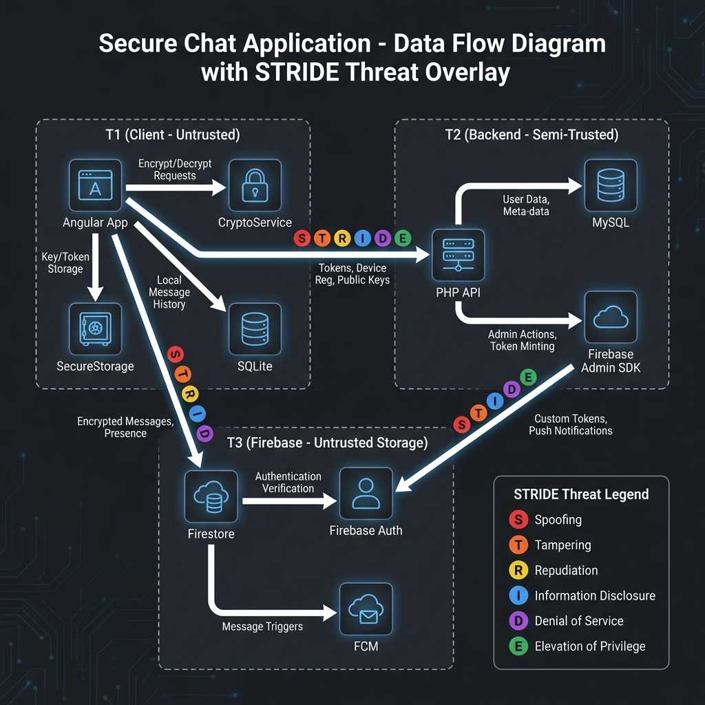

# STRIDE Threat Model Report (TASK 1.3-H) - ChatFlect

> **Version**: 1.0 | **Date**: 2026-02-06 | **Classification**: Internal - Security Sensitive

---

## Executive Summary

This report presents a comprehensive STRIDE threat analysis of the ChatFlect E2EE messaging platform. The analysis identified **47 distinct threats** across four trust boundaries, with **5 CRITICAL** and **11 HIGH** priority vulnerabilities requiring immediate attention.

### Key Findings

- **Backend API Layer** has 6 unauthenticated endpoints (J4-J9) representing the largest attack surface
- **Plaintext backup exports** (H2) expose master private keys without encryption
- **Backend key injection** (E1) remains the single largest trust weakness in the E2EE design
- **Metadata leakage** (I1/I2) reveals activity patterns to server infrastructure

### Recommended Actions

1. **Immediate**: Add JWT authentication to all backend endpoints (Sprint 1)
2. **High Priority**: Implement encrypted backups and signed key bundles (Sprint 1-2)
3. **Medium Term**: Migrate tokens to HTTP-Only cookies, encrypt local cache (Sprint 2)
4. **Long Term**: Implement key transparency log (Sprint 4)

---

## Trust Boundary Overview

| Boundary | Trust Level | Threat Count | Top Risk |
| :--- | :---: | :---: | :--- |
| T1 - Client | Untrusted | 14 | Plaintext backups (H2) |
| T2 - Backend | Semi-Trusted | 12 | Device registration (J4) |
| T3 - Firebase | Untrusted Storage | 14 | Metadata leakage (I1/I2) |
| Crypto Protocol | N/A | 7 | Key injection (E1) |

---

## Threat Matrix Summary

### By STRIDE Category

| Category | Count | Example |
| :--- | :---: | :--- |
| **Spoofing** | 9 | Device impersonation, token theft |
| **Tampering** | 12 | localStorage edits, key injection |
| **Repudiation** | 4 | Missing audit logs |
| **Information Disclosure** | 13 | Plaintext cache, metadata exposure |
| **Denial of Service** | 5 | Upload abuse, message floods |
| **Elevation of Privilege** | 6 | XSS takeover, rules bypass |

### By Priority

| Priority | Count | Threats |
| :--- | :---: | :--- |
| **CRITICAL** | 5 | J4, J5, J7, J8, H2 |
| **HIGH** | 11 | J6, J9, E1, G1, I1, I2, etc. |
| **MEDIUM** | 18 | Various |
| **LOW** | 9 | Various |

---

## Top 10 Critical Threats

| # | ID | Threat | Score | Mitigation |
| :---: | :---: | :--- | :---: | :--- |
| 1 | J4 | Unauthenticated Device Registration | 25 | JWT auth on devices.php |
| 2 | J5 | Group Membership Manipulation | 20 | JWT + role check |
| 3 | J7 | Sensitive Profile Exposure | 20 | Auth + scope limits |
| 4 | J8 | Public Contact Harvesting | 20 | Auth + rate limiting |
| 5 | H2 | Plaintext Backup Exposure | 20 | Password encryption |
| 6 | J6 | Unauthenticated File Upload | 16 | Auth + quotas |
| 7 | E1 | Backend Key Injection | 15 | Signed key bundles |
| 8 | G1 | SQLite Plaintext Cache | 15 | SQLCipher |
| 9 | I1/I2 | Metadata Leakage | 15 | Encrypt metadata |
| 10 | J9 | Identity Spoofing | 15 | Session-bound user_id |

---

## Mitigation Roadmap

| Sprint | Epics | Target Threats |
| :---: | :--- | :--- |
| **Sprint 1** | E1 (Backend Auth), E2 (Backups), E7 (Anti-Abuse) | J4-J9, H2 |
| **Sprint 2** | E3 (Key Bundles), E4 (SQLCipher), E5 (Tokens), E8 (Firestore) | E1, G1 |
| **Sprint 3** | E6 (Metadata), E9 (Audit) | I1, I2 |
| **Sprint 4** | E10 (Key Transparency) | CP-07 |

---

## Document References

| Document | Purpose |
| :--- | :--- |
| [trust-boundary-analysis.md](trust-boundary-analysis.md) | Asset inventory and boundaries |
| [stride-client-t1.md](stride-client-t1.md) | Client layer threats |
| [stride-backend-t2.md](stride-backend-t2.md) | Backend API threats |
| [stride-firebase-t3.md](stride-firebase-t3.md) | Firebase threats |
| [stride-crypto-protocol.md](stride-crypto-protocol.md) | Crypto design threats |
| [risk-scoring-register.md](risk-scoring-register.md) | Complete scored register |
| [mitigation-roadmap-phase2.md](mitigation-roadmap-phase2.md) | Execution plan |
| [security-controls-mapping.md](security-controls-mapping.md) | OWASP/NIST mapping |

---

## Approval

| Role | Name | Signature | Date |
| :--- | :--- | :---: | :---: |
| CTO | | | |
| Security Lead | | | |
| Backend Lead | | | |
| Frontend Lead | | | |
