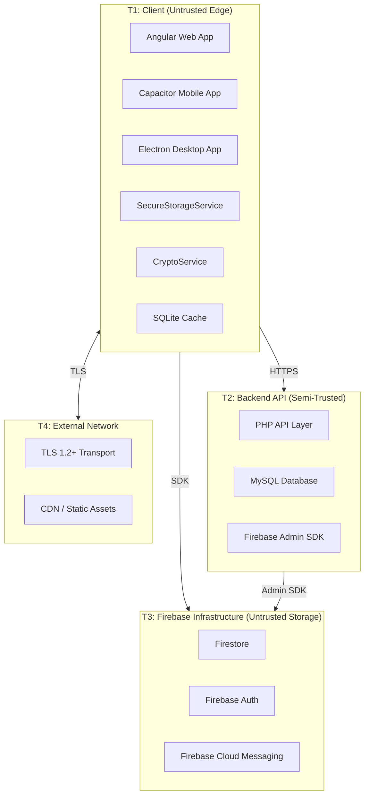

# Trust Boundary Analysis (TASK 1.3-A) - ChatFlect STRIDE Model

> **Version**: 1.0 | **Date**: 2026-02-06 | **Status**: P0 Complete

This document defines the STRIDE model scope, trust boundaries, and asset inventory for ChatFlect.

---

## 1. Trust Boundary Map

---

## 2. Trust Boundary Definitions

| ID | Boundary | Trust Level | Components | Data Crossing |
| :---: | :--- | :--- | :--- | :--- |
| **T1** | Client Application | Untrusted (User-Controlled) | Angular, Capacitor, Electron, SecureStorage, CryptoService, SQLite | Plaintext messages, keys, tokens |
| **T2** | Backend API | Semi-Trusted (Admin-Controlled) | PHP endpoints, MySQL, Firebase Admin SDK | Tokens, public keys, device registry |
| **T3** | Firebase Infrastructure | Untrusted (Third-Party Storage) | Firestore, Firebase Auth, FCM | Encrypted messages, metadata, tokens |
| **T4** | External Network | Untrusted (Public Network) | TLS Transport, CDN | All traffic encrypted in transit |

### Additional Pipelines

| Pipeline | Trust Level | Components |
| :--- | :--- | :--- |
| **Backup Export/Import** | Untrusted (User-Controlled File) | BackupService, JSON file, Private Key |
| **Desktop Sync** | Untrusted (Cross-Device Channel) | LinkService, QR Code, Ephemeral Key |

---

## 3. Asset Inventory with STRIDE Attributes

### 3.1 Identity Assets

| Asset | Sensitivity | Owner | Exposure Surface | STRIDE Focus |
| :--- | :---: | :--- | :--- | :--- |
| **Master RSA Private Key** | CRITICAL | Client (T1) | SecureStorage, Backup JSON | S, T, I |
| **Master RSA Public Key** | LOW | Backend (T2) | MySQL `users.primaryKey` | S, T |
| **Device RSA Key Pair** | HIGH | Client (T1) | SecureStorage | S, T, I |
| **Device UUID** | MEDIUM | Client (T1) | localStorage, MySQL | S |

### 3.2 Session/Ephemeral Keys

| Asset | Sensitivity | Owner | Exposure Surface | STRIDE Focus |
| :--- | :---: | :--- | :--- | :--- |
| **AES-256-GCM Session Key** | HIGH | Client (T1) | Memory only | I |
| **Ratchet Root Key** | HIGH | Client (T1) | localStorage | T, I |
| **Ratchet Chain Keys** | HIGH | Client (T1) | localStorage | T, I |
| **Ephemeral Sync Key** | MEDIUM | Client (T1) | Memory, QR payload | S, I |

### 3.3 Tokens & Credentials

| Asset | Sensitivity | Owner | Exposure Surface | STRIDE Focus |
| :--- | :---: | :--- | :--- | :--- |
| **Firebase ID Token** | HIGH | Client (T1) | localStorage | S, I, E |
| **Firebase Refresh Token** | CRITICAL | Client (T1) | localStorage | S, I, E |
| **PHP JWT (access_token)** | HIGH | Client (T1) | localStorage | S, I, E |
| **PHP Refresh Token** | CRITICAL | Backend (T2) | MySQL `refresh_tokens` | S, T |
| **FCM Push Token** | LOW | Client (T1) | Firestore, MySQL | S |

### 3.4 Message Payloads

| Asset | Sensitivity | Owner | Exposure Surface | STRIDE Focus |
| :--- | :---: | :--- | :--- | :--- |
| **Ciphertext (message.text)** | HIGH | Firestore (T3) | Firestore `messages` | T, R |
| **Encrypted Media Key** | HIGH | Firestore (T3) | Firestore `messages.keys` | T, I |
| **IV (Initialization Vector)** | LOW | Firestore (T3) | Firestore `messages.iv` | T |
| **Decrypted Plaintext** | CRITICAL | Client (T1) | SQLite cache, Memory | I |

### 3.5 Metadata Fields

| Asset | Sensitivity | Owner | Exposure Surface | STRIDE Focus |
| :--- | :---: | :--- | :--- | :--- |
| **senderId / recipientId** | MEDIUM | Firestore (T3) | Firestore `messages` | I |
| **timestamp** | LOW | Firestore (T3) | Firestore `messages` | T, R |
| **keys map (device list)** | MEDIUM | Firestore (T3) | Firestore `messages.keys` | I |
| **lastMessage snippet** | MEDIUM | Firestore (T3) | Firestore `chats.lastMessage` | I |
| **typing / online status** | LOW | Firestore (T3) | Firestore `chats` | I |

### 3.6 Device Registry

| Asset | Sensitivity | Owner | Exposure Surface | STRIDE Focus |
| :--- | :---: | :--- | :--- | :--- |
| **Device Registry (MySQL)** | HIGH | Backend (T2) | MySQL `devices` table | S, T |
| **Public Key Directory** | HIGH | Backend (T2) | MySQL `users.primaryKey` | S, T |

---

## 4. STRIDE Legend

| Code | Category | Description |
| :---: | :--- | :--- |
| **S** | Spoofing | Identity impersonation |
| **T** | Tampering | Data modification |
| **R** | Repudiation | Denying actions |
| **I** | Information Disclosure | Data exposure |
| **D** | Denial of Service | Availability disruption |
| **E** | Elevation of Privilege | Unauthorized access escalation |

---

## 5. Cross-Reference

- **Architecture Diagram**: [architecture-high-level.png](../architecture-high-level.png)
- **Crypto Assets**: [crypto-assets-inventory.md](../crypto/crypto-assets-inventory.md)
- **Security Assumptions**: [security-assumptions.md](../security-assumptions.md)
