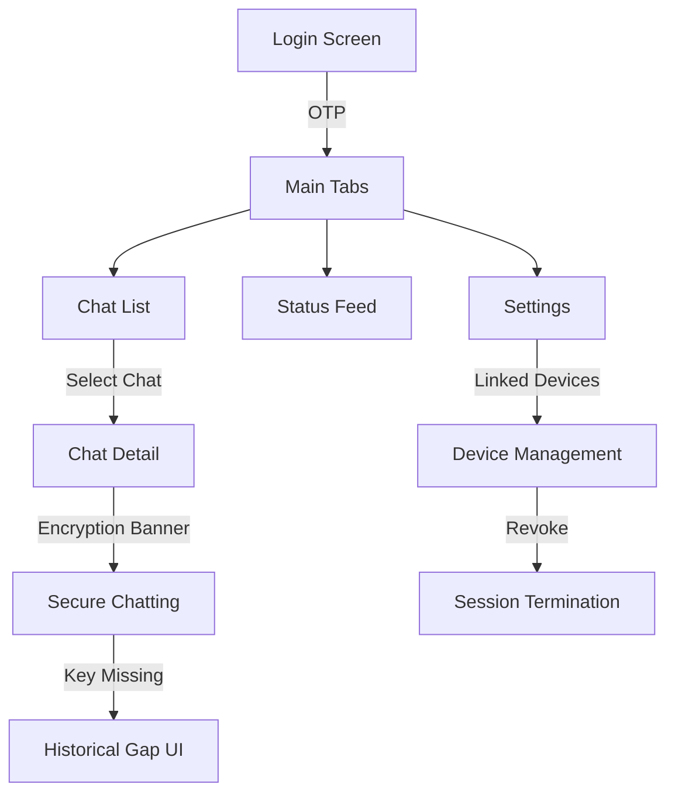

# UX Flow Map (TASK 1.1-K) - ChatFlect

This document maps the end-user journey through the ChatFlect interface, identifying critical security visibility points and the representation of the trust model.

## 1. User Journey Overview

### Stage 1: Signup & Onboarding
1.  **Identity Entry**: User enters Email or uses Google Sign-In.
2.  **Verification**: 6-digit OTP received via email is entered.
3.  **Key Generation**: (Implicit) Master RSA key pair is generated on first-time login.
4.  **Profile Setup**: Setting Name and Profile Picture.

### Stage 2: Core Messaging
1.  **Chat Discovery**: Search contacts or start from the chat list.
2.  **Conversation Entry**: Encryption banner confirmed at the top of the chat.
3.  **Sending**: Message is encrypted -> Sent to Firestore -> Sent tick (✓) -> Read tick (✓✓).
4.  **Receiving**: Message arrives -> Decryption overlay (spinner) -> Content displayed or fallback (KEY_MISSING).

### Stage 3: Multi-Device Experience
1.  **Desktop Initiation**: Switch to QR mode on Desktop Login screen.
2.  **Mobile Handshake**: Mobile user navigates to `Settings > Linked Devices`. (Future enhancement required to trigger scanner).
3.  **Mirroring**: Desktop session mirrors mobile identity via ephemeral key exchange.

---

## 2. Interaction Flow Diagram

---

## 3. Security Visibility Points (SVP)

These points represent where the application communicates its security posture to the end-user.

| SVP ID | UI Location | Description | Trust Indicator |
| :--- | :--- | :--- | :--- |
| **SVP-1** | Chat Detail (Top) | E2E Encryption Banner | "Messages are end-to-end encrypted..." |
| **SVP-2** | Message Bubble | Decryption Overlay | Spinner -> "Decrypting..." |
| **SVP-3** | Message Bubble | Key Missing State | "Key missing for this device" (Historical Gap) |
| **SVP-4** | Message Bubble | Read Receipts | Blue "checkmark-done" icon |
| **SVP-5** | Linked Devices | Device List | List of all authorized RSA keys/UUIDs |
| **SVP-6** | Status Feed | Privacy Badge | Indicator of status visibility (Everyone/Contacts) |
| **SVP-7** | Media Viewer | View Once Badge | Timer icon indicating non-persistent media |

---

## 4. Identified UX Hardening Gaps (Phase 2)

During the audit, the following UX-relevant security gaps were identified:

1.  **Implicit Handshake**: The transition from scanning a QR code to "Sending Session Data" lacks a confirmation "Are you sure you want to link this Desktop?" modal with device fingerprinting.
2.  **Trust Change Warning**: There is currently no UI notification within the chat thread if a recipient adds a new device (Keys changed).
3.  **Identity Verification**: No mechanism (e.g., Security Codes/QR comparison) to "Verify" a contact's identity out-of-band.
4.  **E2EE Awareness**: The encryption banner is only visible inside the chat; the chat list lacks a global "Secure" status indicator.
