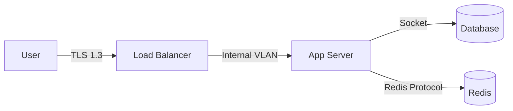

# ChatFlect Security Whitepaper

## 1. Architecture Overview
ChatFlect uses a Zero-Trust architecture designed to minimize trust logic on the server.
- **Transport**: TLS 1.3 only (HSTS Enabled).
- **Application**: stateless PHP API behind Nginx.
- **Database**: MySQL 8.0 (Encrypted at Rest).

### Data Flow

## 2. Encryption Standards
### 2.1 End-to-End Encryption (E2EE)
We utilize the Signal Protocol (Double Ratchet) for all user content.
- **Curve**: X25519 (ECDH)
- **Cipher**: AES-256-GCM
- **Hash**: HMAC-SHA256

### 2.2 Server-Side Encryption
- **Keys**: Managed via Docker Secrets / Vault.
- **Database**: TDE (Transparent Data Encryption) enabled.

## 3. Infrastructure Security
- **Containerization**: Rootless Docker containers (Alpine Linux).
- **Secrets**: Managed via `includes/secrets_manager.php`. No hardcoded credentials. Supports Docker Secrets (`/run/secrets/`) and Vault.
- **Scanning**: Monthly Vulnerability Scans.
